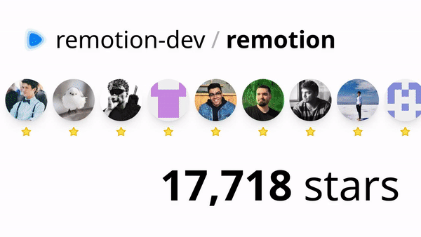

# 🎞️ [GitHub Stars Video](https://scastiel.dev/github-stars) ⭐️

_Generate videos to brag about stars on your GitHub repository!_

## Example output

## Stack

- [Remotion](https://www.remotion.dev/) to create the video (and [Remotion Lambda](https://www.remotion.dev/docs/lambda/api) to generate it in AWS)
- [Next.js](https://nextjs.org/) for the web application
- [TailwindCSS](https://tailwindcss.com/) for the styling
- [shadcn/UI](https://ui.shadcn.com/) for the UI components
- [Vercel](https://vercel.com/) for hosting

## Contribute

If you want to suggest a feature or report a problem, feel free to open an issue or even a pull request 😉.

## License

MIT, see [LICENSE](./LICENSE).
